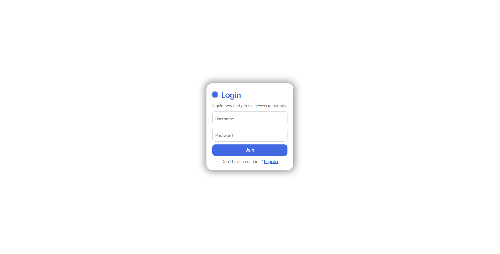
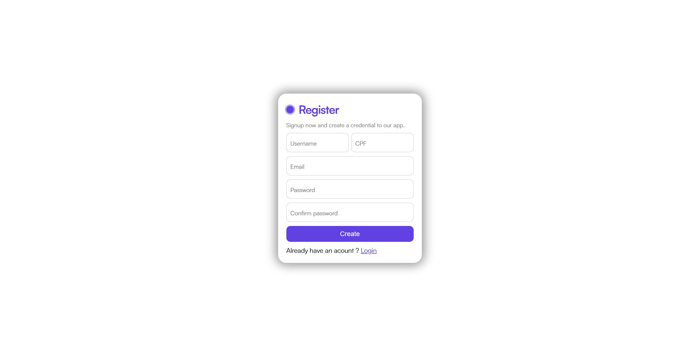
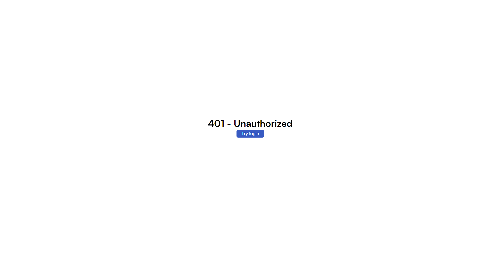

<h1>Login - Autenticação JWT</h1>

<h4>✦ Resumo</h4>

Uma tela de login criada para redirecionamento com base em consulta de usuário em banco de dados, geração de token JWT e autenticação do mesmo, guardando-o no localStorage

<h4>✦ Ferramentas</h4>
<ul>
    <li>HTML</li>
    <li>CSS</li>
    <li>Javascript</li>
	<li>.NET 6</li>
	<li>Dapper</li>
	<li>SQL</li>
</ul>

<h4>✦ Endpoints</h4>
<ul>
    <li>"/auth" => POST - Verificar cliente e gerar token JWT</li>
    <li>"/auth/validate-token" => GET - Validar token informado pelo cliente</li>
    <li>"/costumer" => POST - Registrar cliente o banco de dados</li>
    <li>"/costumer" => GET - Buscar todos os clientes registrados no banco de dados</li>
</ul>

<h4>✦ Imagens do frontend</h4>

<ul>
    <li>Login:  </img></li>
    <li>Register:  </img></li>
    <li>Home:  </img></li>
    <li>Unauthorized:  </img></li>
</ul>